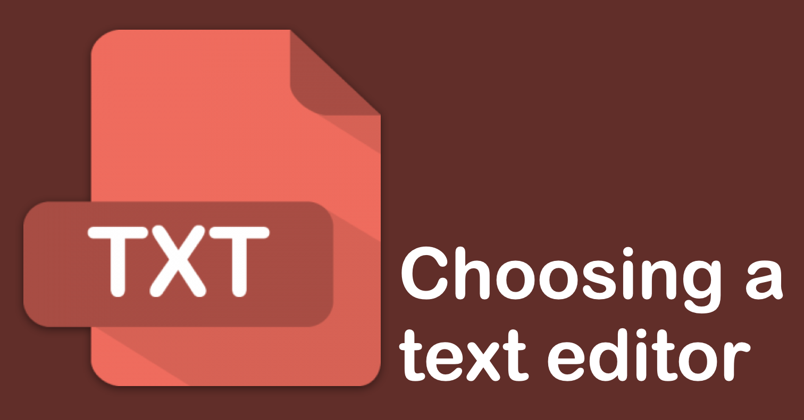

# Choosing a text editor

An important tool for programming and working in several of the DHRI's workshops is a text editor. A text editor is a program that allows you to edit plain text files, such as `.txt`, `.csv`, or `.md`. Text editors are not used to edit rich text documents, such as `.docx` or `.rtf`, and rich text editors should not be used to edit plain text files. This is because rich text editors will add many invisible special characters that will prevent programs from running and configuration files from being read correctly.

While it doesn't really matter which text editor you choose, you should try to become comfortable with at least one text editor.

Choosing a text editor has as much to do with personality as it does with functionality. Graphical user interfaces (GUIs), user options, and "hackability" vary from program to program.

## Default recommendation

For our workshops, we will be using [Visual Studio Code](https://code.visualstudio.com/). Not only is Visual Studio Code free and open source, but it is also consistent across macOS, Windows, and Linux systems.

You can follow our download and installation instructions for [Visual Studio Code](https://github.com/DHRI-Curriculum/install/blob/v2.0/guides/visual-studio-code.md) on the installations page.
